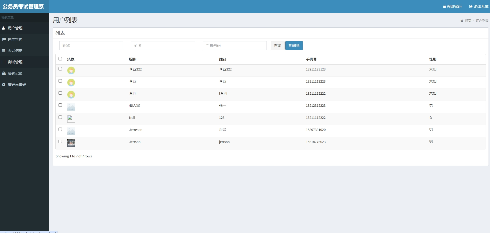
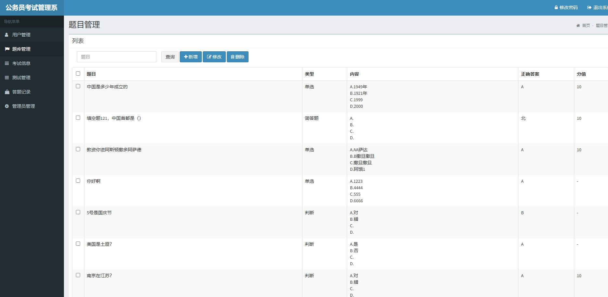
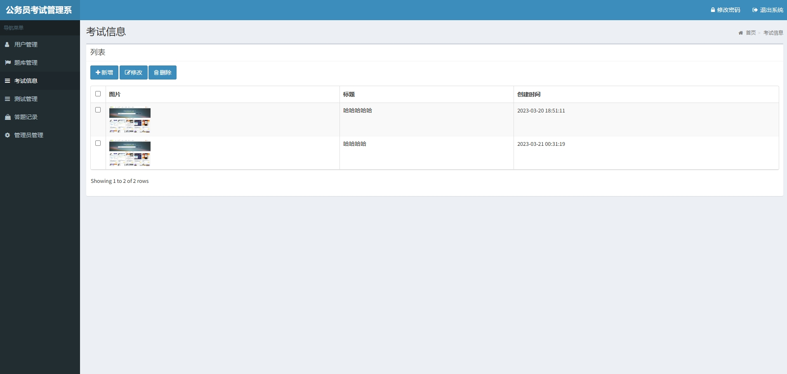
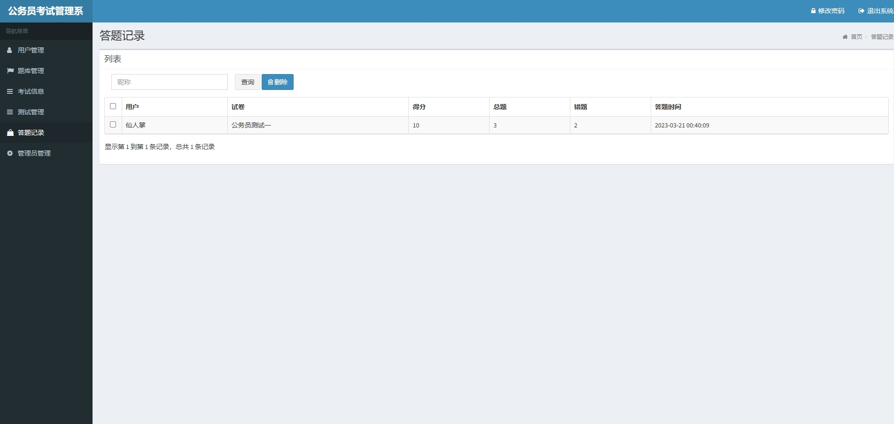
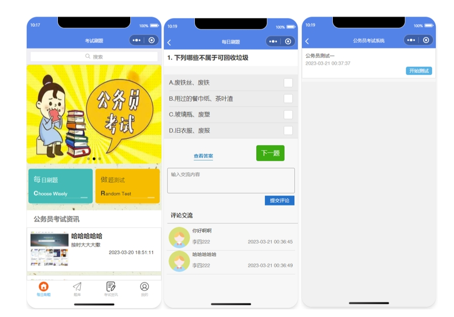
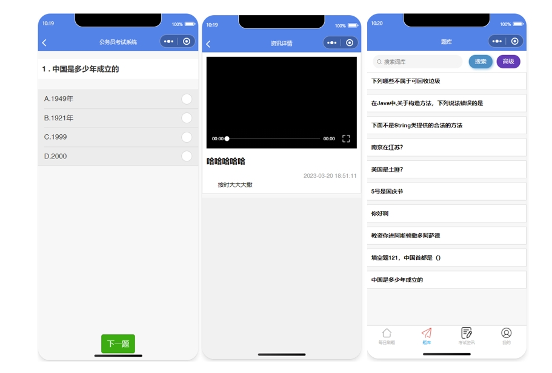
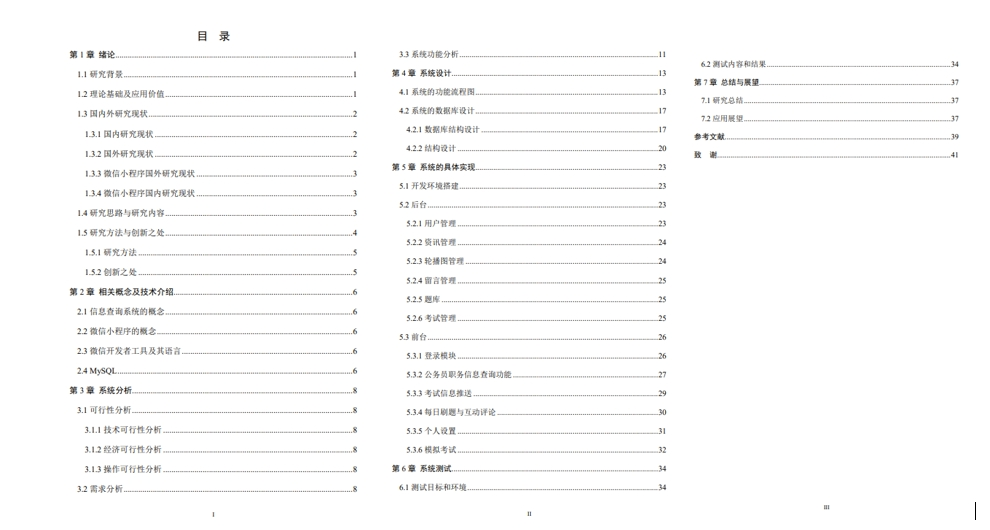

# 1.项目介绍
- 功能模块：小程序（考试信息推送、公务员职务信息查询、每日刷题、互动评论、模拟考试等）、后端管理（用户管理、题库管理等）
- 技术栈：SpringBoot、shiro、druid、fastjson
- 测试环境：idea2024，MySQL5.7，Maven3
- 项目经过本地测试，确保可以运行，如有问题，请先自行检查！

# 2.项目部署
## 2.1后端
- 创建数据库，导入sql
- 通过idea打开后端项目
- 根据本地数据库环境修改src/main/resources/application-dev.yml 3-5行
- 修改src/main/resources/application.yml 48-49行（选用测试号appid即可）
- 运行项目：http://localhost:10001/admin/login.html  管理员账号密码： admin/admin
## 2.2 小程序
- 微信开发工具打开小程序项目
- appid选用测试号
- 测试即可
# 3.项目部分截图

# 4.获取方式
[戳我查看](https://gitee.com/aven999/mall)